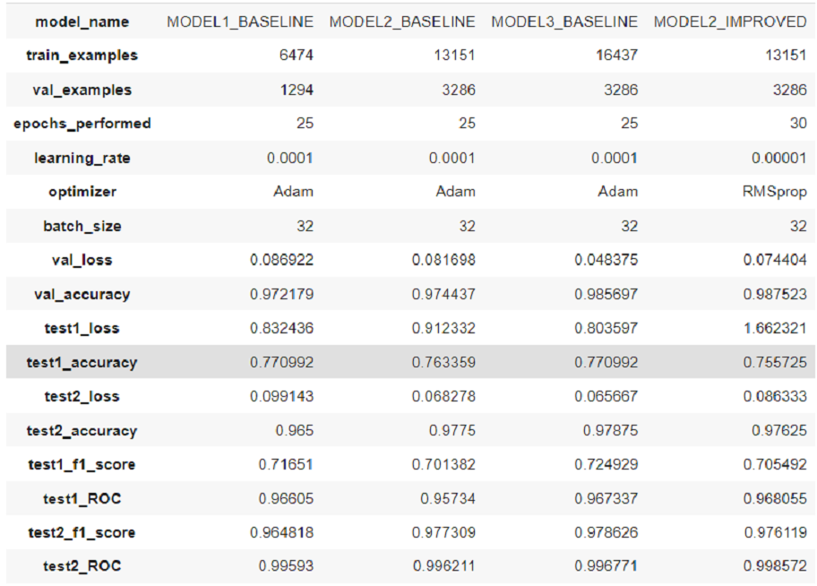

# vehicle-type-classification-based-on-image-data

The aim of the project is to create a neural network model, which basing on the input data in the form of an image files will be able to classify the type of the vehicle.

The goal of the entire project was to create the system (machine learning model) which will recognize ground vehicles in the images and classify them accordingly into 1 of 5 classes:
* [class: bicycle] - here all bicycles and electric scooters 
* [class: bus] - here all city ​​buses, school buses, 9-person buses or greater. Note that in the case of two similar-looking minibuses, the difference is usually that the delivery minibus has no windows for passengers (only at the driver's level), while the minibus carrying people will have windows at the passenger level.
*[class: truck] - here trucks (small and large), vans, also Kangoor vans. Note that in the case of two similar-looking minibuses, the difference is usually that the delivery minibus has no windows for passengers (only at the driver's level), while the minibus carrying people will have windows at the passenger level. 
*[class: motorcycle] - all motorcycles and scooters here
*[class: car] - all cars and minivans here. Also Kangoor passenger cars.

The goal was fully achieved and the results are satisfactory. In the case of motorcycles and bicycles the classification went perfectly - the model has no problem classifying it and usually makes no mistakes. In the case of car, bus and truck mistakes occurs. The reason for that is the problem with distinguishing minibus-like passenger cars and vans. The possible solution for the problem would be to create a separate class for the minivan-like vehicles and store all ambiguous examples there. 
The table below presents the comparison of all the models used and evaluated in the project. The source code is attached to the repository. 
Full project documentation can be found at [project full report](FINAL_REPORT.pdf).
English version is available from stage 3 of the project: [project english report](STAGE3_REPORT.pdf).

